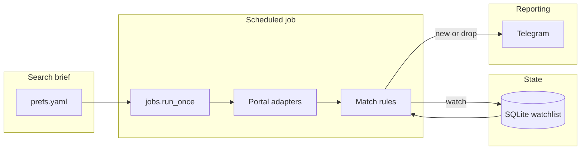

# Rental Scout

An orchestration layer for **residential rental search**.

Listing portals are built for browsing. House hunting is a monitoring problem: the same neighborhoods, the same constraints, checked on a schedule, with a memory of what you already saw and a report when something actually changed.

Rental Scout is that loop — fetch, normalize, match, persist, report — so a search brief is executed by a worker instead of by refreshing tabs.

## Mission

Treat property search as a small operations pipeline, not as a website.

1. **Declare the brief once** — neighborhoods, size, price band, property type.
2. **Pull listings on a schedule** from the portals that are enabled.
3. **Normalize every posting** into the same `Listing` contract.
4. **Remember state** so a house is not “new” twice.
5. **Report only what matters** — a qualifying listing, or a price drop into range.

The current campaign is gated communities in **Tigre / Pacheco (Buenos Aires)**. The code is the orchestrator; the campaign lives in configuration.

## Pipeline



Each pass is one shot. Nothing sits in a long-running server. A timer (systemd, cron, or launchd) starts `python -m jobs.run_once`, the job exits, and the next tick does it again.

| Stage | What happens |
| --- | --- |
| **Fetch** | Enabled adapters pull public search pages. WAF/captcha responses are skipped; they are not bypassed. |
| **Normalize** | Portal-specific HTML/JSON becomes a `Listing` (id, barrio, size, USD rent, expenses, url). |
| **Watch** | Houses that match the brief and sit at or below the watch cap are upserted. |
| **Notify** | First time a listing is in the notify band → new-listing report. Later, a large enough drop → price-drop report. |
| **Dedupe** | Notifications are recorded. The same house does not page twice for the same event. |

## Architecture

```
prefs.yaml          search brief (neighborhoods, size, USD band, adapters)
src/adapters/       one fetcher per portal (ZonaProp, Argenprop, Mercado Libre)
src/models.py       shared Listing contract
src/match.py        watch / match / price-drop rules
src/db.py           SQLite watchlist + notification log
src/notify_telegram.py   report formatter + delivery
jobs/run_once.py    the orchestrator
```

Adapters are independently toggleable. A portal that is blocked, flaky, or out of scope is turned off in `prefs.yaml` without touching the rest of the pipeline.

The worker is **read-only against the portals** and **append-mostly against its own database**. It does not post listings, create accounts, or solve challenges.

## Search brief

The brief is data. Change `prefs.yaml` to retarget the scout:

- Neighborhoods (countries / barrios)
- House vs other types
- Minimum bedrooms and rooms (`ambientes`)
- USD rent band for alerts, plus a watch cap so a drop into range can fire
- Which adapters to run

Code stays the same. The next scheduled pass picks up the new brief.

## Reports

Alerts are short operational messages, not portal clones:

- Headline with neighborhood and rent
- Bedrooms, price, expenses
- Link to the listing
- Why it matched the brief

Two event types: a house that newly qualifies, and a house that dropped enough to matter.

## Run it

Python 3.12+. Secrets live in a local `.env` (gitignored). Copy `.env.example` and fill it in — never commit that file.

```bash
python3.12 -m venv venv
source venv/bin/activate
pip install -e ".[dev]"
cp .env.example .env
```

```bash
pytest
python -m jobs.run_once --dry-run   # fetch + persist, no reports
python -m jobs.run_once             # fetch + persist + report
```

`--dry-run` does not consume the “already notified” flag. The first live pass can still report qualifying listings.

Schedule the live command on whatever worker you operate (systemd timer, cron, launchd). Keep credentials in the process environment, not in the repository.

## What this repo does not contain

- API keys, bot tokens, chat ids, or OAuth secrets
- The SQLite watchlist (`data/` is local)
- Hostnames, IPs, or SSH material for the worker

If you fork this, treat `.env` and the database as private to the machine that runs the job.
